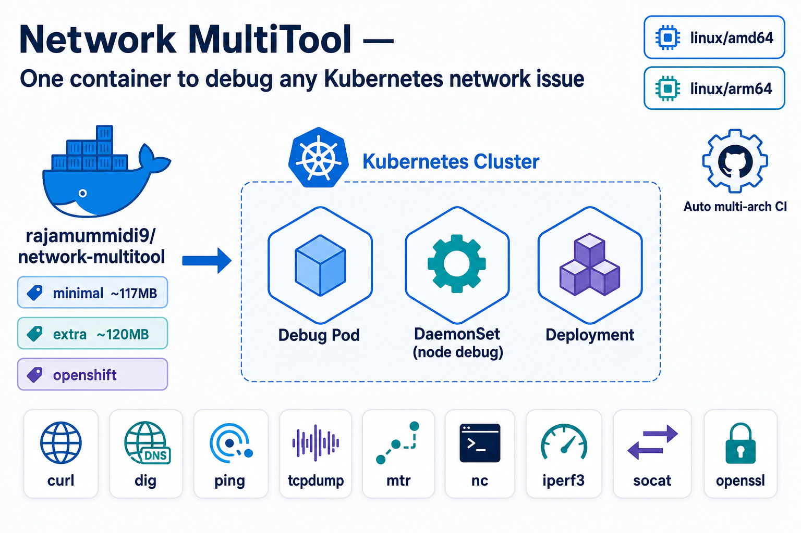

# Network MultiTool

[](https://hub.docker.com/r/rajamummidi9/network-multitool)
[](https://github.com/rajamummidi9/network-multitool)
[](LICENSE)
[]()

**One image. Every network tool. Any Kubernetes cluster.**



---

## Copy & paste — start debugging in 10 seconds

### Kubernetes (no install, no clone)

```bash
kubectl run netdebug --rm -it --restart=Never \
  --image=rajamummidi9/network-multitool \
  --image-pull-policy=Always -- bash
```

### Docker

```bash
docker run --rm -it rajamummidi9/network-multitool bash
```

### One-liner script

```bash
curl -fsSL https://raw.githubusercontent.com/rajamummidi9/network-multitool/main/scripts/debug.sh | bash
```

> Full quick-start guide: [QUICKSTART.md](QUICKSTART.md)

---

Maintained by **rajamummidi9** — mummidiraja9@gmail.com

| Resource | URL |
|----------|-----|
| Docker image | `rajamummidi9/network-multitool` |
| GitHub | https://github.com/rajamummidi9/network-multitool |
| Docker Hub | https://hub.docker.com/r/rajamummidi9/network-multitool |

## Image variants

| Tag | Size | Use case |
|-----|------|----------|
| `latest`, `minimal` | ~117 MB | Default — lean core toolkit |
| `extra` | ~120 MB | + socat, nc, iperf3, ethtool, lsof, traceroute |
| `openshift` | ~119 MB | Non-root, ports **1180** / **11443** |

**Platforms:** `linux/amd64`, `linux/arm64`

## Kubernetes manifests (no clone needed)

```bash
# Debug pod (persistent — exec in anytime)
kubectl apply -f https://raw.githubusercontent.com/rajamummidi9/network-multitool/main/kubernetes/debug-pod.yaml
kubectl exec -it network-multitool-debug -- bash

# Deployment + Service
kubectl apply -k https://github.com/rajamummidi9/network-multitool/kubernetes/

# DaemonSet on every node (hostNetwork)
kubectl apply -f https://raw.githubusercontent.com/rajamummidi9/network-multitool/main/kubernetes/daemonset.yaml
```

## Works everywhere

| Platform | Command |
|----------|---------|
| AWS EKS | `kubectl run netdebug --rm -it --image=rajamummidi9/network-multitool -- bash` |
| Azure AKS | same |
| Google GKE | same |
| Kind / Minikube | same |
| OpenShift | use `:openshift` tag |
| Docker local | `docker run --rm -it rajamummidi9/network-multitool bash` |

## Tools included

**minimal:** curl, wget, dig, nslookup, ping, mtr, tcpdump, jq, ip, netstat, telnet, nginx, openssl, ssh, rsync

**extra adds:** socat, nc, iperf3, ethtool, lsof, traceroute

## Build locally

```bash
make build-minimal
make build-extra
make build-openshift
```

## Docs

- [QUICKSTART.md](QUICKSTART.md) — copy-paste commands
- [docs/blog-post.md](docs/blog-post.md) — blog article
- [docs/social-posts.md](docs/social-posts.md) — LinkedIn / Slack copy
- [docs/CI-SETUP.md](docs/CI-SETUP.md) — CI secrets

## License

MIT — Copyright (c) 2026 rajamummidi9
